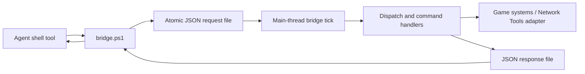
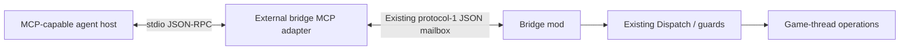

# MCP for Cities II Agent Bridge: feasibility and value

Research date: 2026-09-29. Baseline checkout observed: `f0d6882`. This is a read-only investigation with documentation output. No bridge requests, live queries, game actions, code edits, configuration changes, installations or builds were performed.

## Recommendation

**Add MCP as an agent-facing interface, initially through a separate local adapter process that uses the existing mailbox. Do not replace the mailbox or embed a full MCP HTTP server in the game as the first step.**

An in-mod MCP server is technically feasible, but offers little extra agent-facing value over an external adapter while creating significantly more runtime, networking and lifecycle work. Agents would get the same discoverable tools in either design. Keeping the protocol outside Unity lets us adopt a normal supported SDK/runtime and test most of the implementation without launching CS2.

The present bridge already contains the valuable part: domain-specific commands, native tool integration, session checks, bounded simulation, operation status, and now the Network Tools adapter. MCP should expose those capabilities rather than reimplement them.

| Question | Assessment |
| --- | --- |
| Can the mod host an MCP server? | Yes in principle, using a compatible protocol implementation plus a main-thread command queue; not demonstrated or compiled here. |
| Can agents benefit from MCP without changing the mod? | Yes: an external MCP server can translate typed tool calls to protocol-1 mailbox requests. |
| Is MCP likely worthwhile for this project? | Yes for multiple agents/hosts and repeated interactive workflows; less compelling for a single fixed regression script. |
| Does MCP inherently improve game correctness or permission handling? | No. Those remain application responsibilities. |
| Does MCP require HTTP, a public port, or a cloud service? | No. A local stdio adapter is the recommended first deployment. |
| Should the mailbox be removed? | No evidence justifies that now. Retain it for compatibility, diagnostics and existing automation. |

## 1. Current architecture, grounded in this checkout

Paths below are relative to the bridge repository. File/line references identify the code read during research; concurrent work may move them. The user's report that recent automation works is accepted as user-reported runtime evidence. This session did not independently reproduce it.

### Agent request path

[bridge.ps1](../bridge.ps1) accepts a command from a ValidateSet plus ArgsJson. It reads `session.json`, requires a ready heartbeat no more than 10 seconds old, generates a GUID request ID, includes process session and citySession, and writes a temporary file before renaming it into `requests`. Its default request timeout is 15 seconds, configurable from 1 to 45. It polls the matching response every 100 ms and prints JSON. It does not retry a mutation after a response-read failure.

[src/Mailbox.cs](../src/Mailbox.cs):44-103 checks file size (16,384 bytes), ID, protocol, session, expiry and citySession before invoking Dispatch. Requests may expire no more than 60 seconds into the future. It handles up to four enumerated request files per Pump. Existing response files suppress execution of repeated IDs; in-memory pendingResponses preserves dispatched outcomes during response-publication contention. Responses remain on disk until explicitly cleaned.

[src/Mod.cs](../src/Mod.cs):91-110 runs the mailbox on a game updater with a 250 ms wall-clock interval. [src/BridgeTick.cs](../src/BridgeTick.cs):9-18 checks STOP and simulation deadlines before attempting heartbeat/request communication. Network Tools requests now reach [src/NetworkToolsAdapter.cs](../src/NetworkToolsAdapter.cs):7-20, which invokes the public `NetworkTools.Automation.BridgeApi.InvokeV1(string,string)` contract after city/control/operation checks.

This is already a custom request/response protocol with a useful game API. JSON files are its transport. MCP would add a standard agent-facing protocol and schema layer; it would not make the game understand agents for the first time.

### Existing command coverage and agent burden

[commands.json](../commands.json) lists command names, but not argument/result schemas. [docs/COMMANDS.md](COMMANDS.md) supplies human-readable argument guidance. The client allowlist, dispatcher, capabilities and reference text duplicate parts of the command inventory. The documentation's introductory count is older than the newly added nt_* commands.

Agents currently must discover the script, construct shell-safe JSON arguments, interpret the envelope, distinguish queued from completed operations, poll, follow pagination, and preserve session identity. [advance.ps1](../advance.ps1) already automates some of that for bounded simulation. A persistent MCP adapter could reuse those semantics while removing shell quoting and subprocess orchestration from ordinary tool calls.

### Current behavior differs from older installation prose

[src/Settings.cs](../src/Settings.cs):15-20 now includes RememberControl, default false. Mod.OnLoad and OnPreload conditionally reset AllowControl only when that opt-in is disabled; citySession still changes. STOP and bridge faults revoke permission through RevokeControl and persist it off. Older README/INSTALL passages describing an unconditional reset are not a full description of the current source.

An MCP adapter must honor this actual behavior. It should neither silently enable controls nor undo the user's selected persistence policy. Transport authentication and game-control permission are separate concepts.

## 2. What MCP adds

MCP exposes named tools through discovery, with JSON Schema inputs, optional output schemas, and structured results. An agent host can present and invoke them directly rather than requiring a shell command for each interaction. MCP also supports resources for retrievable data. [MCP tools specification](https://modelcontextprotocol.io/specification/2026-07-28/server/tools).

For this bridge, the concrete gains would be:

- **Typed calls:** entity indices/versions, strength ranges, frame budgets and expected revisions become visible inputs instead of examples embedded in prose.
- **Discovery:** a new agent can list available bridge tools and identify optional Network Tools support.
- **Narrower access:** a host could grant bridge-tool access without granting the agent a general-purpose shell. This is a deployment choice, not automatic sandboxing of the game.
- **Consistent errors:** stale city, controls disabled, adapter unavailable, expired request and unknown outcome can be represented uniformly.
- **Reusable orchestration:** one adapter manages heartbeat checks, response correlation, pagination rules and operation polling for multiple MCP-capable hosts.
- **Better observability:** tool name, inputs, elapsed time and result can appear in the host's tool UI. Existing journals still need an explicit integration if they are to be preserved.

The largest likely benefit is fewer integration mistakes and less repetitive agent instruction. Token savings and faster completion are hypotheses to measure, not established performance results. Large schemas or full-city dumps can instead increase context usage.

What MCP does not supply: missing game actions, preview correctness, persistent operation results, idempotency, a cooperative editing lock, safe parameter semantics, or proof a checkpoint is durable. Wrapping an unreliable command makes it easier to call, not more reliable.

## 3. Architecture choices

| Design | Feasibility / effort | Benefits | Costs |
| --- | --- | --- | --- |
| Current PowerShell/file workflow | Already implemented | Minimal runtime dependencies; easy inspection; scripts keep working | Shell/JSON handling and manual discovery |
| External MCP -> existing mailbox | High feasibility; lowest incremental risk | Standard SDK, independent testing/restart, no new game dependencies | Mailbox latency remains; extra process/package |
| External MCP -> new named-pipe/local IPC endpoint | Feasible later | Removes filesystem polling; keeps MCP outside Unity | Mod transport changes, framing/backpressure/recovery work |
| MCP Streamable HTTP embedded in mod | Feasible but highest integration burden | Direct endpoint while game runs; potentially lower transport overhead | SDK/Mono compatibility, listener/authentication, thread handoff, game-coupled failures |
| Mod starts an external MCP helper | Feasible, awkward default | Could offer a one-click user experience | Process ownership, helper updates and orphan cleanup; stdio host ownership mismatch |

### Recommended split

The adapter can stay available while CS2 is stopped and return a clear game_unavailable result. Restarting the adapter must not launch, restart or terminate the game. Existing PowerShell clients remain usable, although concurrent mutation ownership must be coordinated.

This is an **adapter pattern**: two protocols describe the same underlying operations. Keeping MCP in another process is also **fault isolation**: parser/server crashes and dependency changes do not have to bring down the Unity process.

### Why stdio is a good first choice

With stdio, the MCP client starts the server subprocess and exchanges newline-delimited JSON-RPC over stdin/stdout; diagnostics go to stderr. That fits a small external adapter. It does not fit treating the already-running Steam game as a disposable MCP child: MCP host shutdown can terminate its server process. Keep game lifetime separate. [MCP stdio transport](https://modelcontextprotocol.io/specification/2026-07-28/basic/transports/stdio).

A cloud-hosted client cannot reach the user's local stdio process or localhost just because an MCP server exists. It needs a host-provided local connector or a separately designed reachable service. Remote access is a separate deployment decision, not a reason to expose the game to the Internet by default.

## 4. Can MCP realistically run inside the mod?

### Runtime constraints

[build.ps1](../build.ps1):12-29 invokes Roslyn with C# 9, `/nostdlib+`, and an explicit list of installed game/Unity/framework assemblies, matching the game's net48-style mod environment. It does not restore a normal SDK project's MCP NuGet dependency graph. [tests/MailboxTests.csproj](../tests/MailboxTests.csproj) targets .NET 10, but that is the external test process, not evidence the game runs .NET 10.

The official C# SDK Core project currently targets netstandard2.0 as well as modern .NET. Therefore it would be inaccurate to call embedded MCP impossible merely because the game uses an older runtime. Its netstandard path includes dependencies such as System.Text.Json, Channels, Immutable collections and additional compatibility libraries. Nominal target compatibility is not proof those dependencies load and behave correctly inside this Unity Mono installation. [Official Core project](https://raw.githubusercontent.com/modelcontextprotocol/csharp-sdk/main/src/ModelContextProtocol.Core/ModelContextProtocol.Core.csproj).

The SDK's ASP.NET Core hosting project targets net8.0/net9.0/net10.0 and references Microsoft.AspNetCore.App. It is not a drop-in library for this mod's build/runtime. A direct in-game HTTP design would need a compatible host/transport implementation or a substantial integration strategy. [Official ASP.NET Core project](https://raw.githubusercontent.com/modelcontextprotocol/csharp-sdk/main/src/ModelContextProtocol.AspNetCore/ModelContextProtocol.AspNetCore.csproj).

These are upstream main-branch source observations as of the research date, not a pinned package compatibility test. Choose and pin an SDK release before implementation. No SDK was installed or loaded into the game here.

### Threading and game lifetime

A listener would parse requests off the main thread, place validated command envelopes on a bounded queue, and execute the existing handlers on the game thread. Worker threads cannot directly access Unity ECS/tool state. The queue must preserve expiry, control checks, citySession and operation coordination at execution time, not just receipt time.

Responses must distinguish accepted from completed. Keep operation waiting asynchronous outside the main thread; waiting for preview jobs while blocking the game loop can prevent the very completion being awaited. On city change or mod disposal, reject/invalidate queued work and close listeners cleanly.

The present 250 ms tick and four-request batch are useful bounds. Replacing disk transport with a socket but continuing to drain only every 250 ms leaves much of that latency unchanged. Draining per frame would be a separate scheduling change requiring frame-budget tests.

### Network obligations

A local HTTP server adds listener configuration, port collision handling and endpoint authentication. MCP's Streamable HTTP specification requires Origin validation, recommends localhost binding and authentication, and defines protocol-specific request/response behavior. A minimal custom JSON endpoint is not automatically MCP. [Streamable HTTP specification](https://modelcontextprotocol.io/specification/2026-07-28/basic/transports/streamable-http).

For this project, that engineering belongs more comfortably in an external service if HTTP becomes necessary. A local endpoint is still an access boundary; permitting requests from a webpage or another account must not be an accidental consequence of binding a socket.

## 5. Proposed MCP surface

Avoid making the only tool `bridge_command(command, argsJson)`. That would retain most of the current agent burden. Expose typed, descriptive tools, initially a small subset supporting the actual development loop.

| Proposed tool | Existing implementation / role |
| --- | --- |
| `bridge_status` | Read heartbeat without a gameplay query; optionally explicit ping |
| `get_capabilities` | Existing capability response, annotated with adapter/API fingerprints |
| `nt_get_state` | Network Tools state through InvokeV1 |
| `nt_activate`, `nt_select`, `nt_strength`, `nt_clear`, `nt_apply` | Existing typed mod operations, preserving revision checks |
| `get_junction_snapshot`, `get_junction_preview` | Existing paused diagnostics with completeness fields intact |
| `get_operation` | Existing operation status |
| `simulate_step`, `get_simulation_step`, `cancel_simulation_step` | Existing bounded simulation lifecycle |
| `save_checkpoint` | Existing checkpoint request; preserve its actual verification level |
| `stop` | Create the existing STOP latch; acknowledge request separately from confirmed stop |

Descriptions must specify units, prerequisites, side effects and completion semantics. Unsupported optional integrations should produce a clear unavailable result or a deliberately versioned capability indication. A stable known tool list with availability reported by status is a reasonable first implementation; do not infer support solely from an assembly name.

Create a single machine-readable command catalog over time: names, schemas, bounds, side effects, session requirements and completion policy. Derive MCP definitions, client validation and documentation from it. The existing commands.json is a name list, so adding MCP without that discipline creates another schema source that can drift. Keep the mod's authoritative runtime validation even when the adapter validates first.

### Do not mislabel queries

`Mod.Dispatch` around lines 158-166 calls PauseAnalysis for many commands when controls are enabled. Thus `get_city_state`, for example, can change simulation state. The local variable statusOnly also includes every nt_* command to skip that auto-pause path; it is not a classification of read-only behavior.

Use readOnlyHint only after auditing actual behavior. `nt_strength` and `nt_apply` are mutations regardless of whether they skip auto-pause. Annotation hints are descriptive metadata, not permission enforcement or a guarantee of idempotency. [MCP annotation schema](https://raw.githubusercontent.com/modelcontextprotocol/modelcontextprotocol/main/schema/2026-07-28/schema.ts).

Resources should preferably expose already captured immutable diagnostics or documentation. Do not make a background resource refresh unexpectedly invoke a command that pauses a running simulation. Keep nextOffset, complete, errors, snapshotId and citySession visible in results. Protocol pagination for listing tools is separate from city-data pagination implemented by [src/QueryPage.cs](../src/QueryPage.cs).

## 6. Reliability requirements that survive a transport change

### Three identities, not one

Keep these separate in adapter state/results:

1. MCP request ID: correlation for one protocol exchange.
2. Mailbox request ID: identity of the submitted bridge command.
3. Game operation ID: identity of asynchronous work started by that command.

Also preserve the bridge process session, citySession and any Network Tools preview/input revision. An MCP connection is not a city session. A reconnect or a new protocol ID must not silently recreate a construction request.

### Timeout and restart behavior

The mailbox deduplicates the same request ID while its response exists, and retains a result in memory if publication temporarily fails. It does not provide a universal exactly-once transaction across crashes. The game could apply work before a crash that prevents recording the result. Existing retained responses also depend on their retention policy.

An adapter should persist mutation submission intent and the mailbox-ID mapping before publishing. After a timeout/disconnect/restart, inspect the original response and operation rather than creating a new GUID and submitting again. Where recovery cannot establish outcome, report `outcome_unknown` with identities for inspection. A client-supplied intent/idempotency key can help distinguish retry from a new desired action; MCP request IDs alone are insufficient.

Never rebind a pending mutation to a newly loaded citySession. Do not indefinitely queue gameplay while the game is stopped: reject clearly, or require a bounded explicit expected session. File responses can be valid protocol responses whose domain result is still queued, partial, rejected or failed.

### Long operations and cancellation

Start by preserving start-operation + get-operation tools. A convenience wait tool can poll outside Unity with a bounded timeout and progress reporting. It must preserve the operation handle if the client stops waiting.

MCP's current Tasks extension can wrap long work with durable handles and status polling, but requires explicit client/server support and durable task state. The bridge's in-memory ConstructionAccess.Results dictionary is not automatically that durable task store. Treat Tasks as a later enhancement, not a prerequisite. [MCP Tasks extension](https://modelcontextprotocol.io/extensions/tasks/overview).

Cancelling an MCP request is not an undo command. Before mailbox publication, cancellation can prevent submission. After submission, it cannot promise the command did not execute. Use existing cancel_simulation_step/cancel_batch only where their documented scope applies; a save may be allowed to finish. A lost client connection must not force-kill CS2.

STOP should retain a path independent of a healthy MCP process. Preserve bridge.ps1 stop and the mod's early STOP/deadline enforcement. A STOP-file write confirms a request to stop, not that a hung game has processed it.

### Multiple agents

Separate stdio adapters can target the same mailbox. Serial execution on the game thread is not exclusive workflow ownership: one agent can alter selection between another's state read and Apply. An adapter-local mutex protects only that adapter; another MCP process or PowerShell client can bypass it.

Initially enforce one controlling workflow by coordination, retain all existing revision/session guards, and refuse overlapping operations where supported. If true multi-client editing is required, add an authoritative ownership/lease mechanism checked inside the mod across every transport, with expiry and STOP override. Parallel observational work is only safe for commands whose real semantics are observational.

## 7. Protocol-version and client compatibility

The official MCP 2026-07-28 release changed lifecycle semantics: the core uses per-request metadata and removed the initialize/initialized handshake and protocol-level HTTP session header; application state can still use explicit handles. Older 2025-11-25 clients follow a different lifecycle. Do not hand-roll a hybrid from examples of both eras. [Current release explanation](https://blog.modelcontextprotocol.io/posts/2026-07-28/), [older lifecycle specification](https://modelcontextprotocol.io/specification/2025-11-25/basic/lifecycle).

Pin an SDK version and explicitly record supported protocol revisions and tested agent hosts. Client support for transports, task extensions, resources and structured results must be tested rather than inferred from the phrase MCP-compatible. Plain typed tools with explicit operation polling minimize optional-feature dependencies.

Use the SDK's protocol implementation; own the bridge-domain mapping. Keep any HTTP authorization separate from AllowControl/RememberControl. No host configuration or version-specific client setup was changed or verified in this investigation.

## 8. Expected performance and value

The current idle request scheduling delay is up to roughly one 250 ms tick, plus client response polling up to roughly 100 ms, filesystem work, game stalls and command time. These are code-derived scheduling components, not measured latency percentiles or hard upper bounds. Four requests per tick yields a nominal ceiling around 16 dispatched requests/second for cheap work under ideal conditions; expensive queries and enumeration/order effects reduce that.

A persistent external adapter avoids launching PowerShell for each call if it speaks mailbox protocol directly, and can centralize polling. It does not remove the mod tick or accelerate geometry jobs. An embedded/per-frame server might reduce interactive latency, but model turn time and game work may dominate anyway. The bridge is a control interface, not a suitable per-frame high-rate data stream.

Suggested measurements before optimizing transport:

- Median/p95 tool-call overhead, separately from game operation completion.
- Shell/JSON formatting failures versus typed-call validation failures.
- Agent turns needed for select -> strength -> preview -> Apply -> verification.
- Main-thread cost under bounded concurrent diagnostics and response sizes.
- Behavior after adapter restart, stale heartbeat and city transition.

| Investment | Expected value for this project |
| --- | --- |
| Typed MCP adapter for the common development loop | High usability value; modest initial scope |
| Full schema/catalog coverage | Useful as command set grows; meaningful maintenance cost |
| Replacing mailbox solely for speed | Unproven value until measurement |
| Embedding full HTTP MCP in Unity | Low initial return relative to integration burden |
| Remote multi-user/cloud game control | Separate product/security scope; not necessary for local iteration |

## 9. Incremental implementation plan, not performed

**Phase 1: external stdio proof of concept.** Use a supported standalone runtime/official SDK. A modern .NET console app is a natural fit with the existing C# tests; TypeScript or Python are also viable. Pin dependencies. Keep game DLLs out of the adapter: it needs protocol JSON and schemas, not Unity types. Ship/configure it explicitly; do not launch a helper silently from mod load.

Start with status, capabilities, nt_get_state and a small set of paused diagnostics. First exercise a synthetic mailbox, then an authorized live session. A temporary implementation may invoke bridge.ps1 as a subprocess, but must use structured process arguments, capture warning/error streams separately and avoid polluting MCP stdout. Direct protocol implementation is the cleaner persistent version; preserve its atomic-write and read-sharing behavior.

**Phase 2: bounded control.** Add typed nt_* commands, operation polling, STOP, mutation identity persistence and tested error mapping. Keep data completeness flags. Preserve optional journaling deliberately; bypassing bridge.ps1 bypasses its Record-JournalEvent calls. Use structuredContent plus concise human-readable summaries, not huge repeated raw dumps. Tool execution failures should remain distinguishable from malformed MCP protocol requests. [MCP tool error/result contract](https://modelcontextprotocol.io/specification/2025-11-25/server/tools).

**Phase 3: broader coverage and recovery.** Introduce the common catalog, retained-result resources, package/version detection and tested replay protection. Define one controller across transports if concurrent agents become normal.

**Phase 4: transport optimization only if justified.** If measured mailbox overhead is a material bottleneck, introduce a named-pipe/local IPC backend while leaving the MCP API stable. Embed HTTP MCP only if a concrete deployment requirement outweighs the isolation benefits.

Acceptance tests should include schema validation, wrong city/session/revision, disabled controls, STOP, partial results, stale heartbeat, file contention, duplicate IDs, response loss after mutation, adapter restart, cancellation after submission, multiple adapters, and no-game availability. Existing RecoveryTests and MailboxClientTests provide relevant fixtures; they were read, not executed in this task. A fake-mailbox test must never default to the live mailbox path.

## 10. Final assessment and evidence limits

The bridge is well positioned for MCP because it already has explicit commands and a transport boundary. Its new Network Tools integration is exactly the kind of domain API that makes typed tools useful. **The recommended project is an MCP adapter for the bridge, not a rewrite of the bridge into a web server.**

This conclusion comes from source inspection and current primary protocol/SDK documentation. It is not a prototype, benchmark, runtime compatibility result or client certification. The report makes no claim to have independently verified the user's successful automation runs. It also does not supersede game-operation correctness checks: the inspected Workflow save path still derives completion from its Save task, so the earlier save-verification research remains relevant wherever an MCP tool presents checkpoint success.

Only this report and its research session note were created. The pre-existing autonomous-sprint note and concurrent code work were left untouched.
